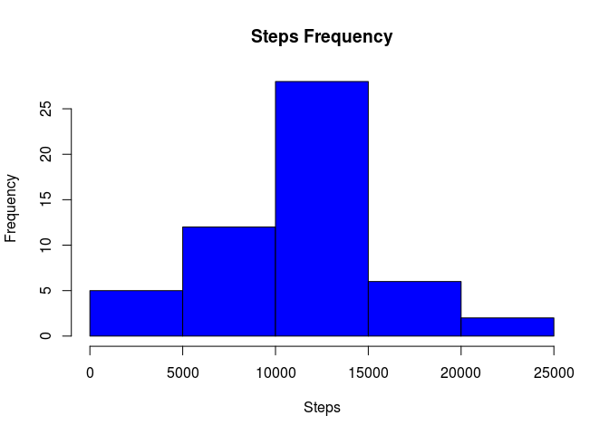
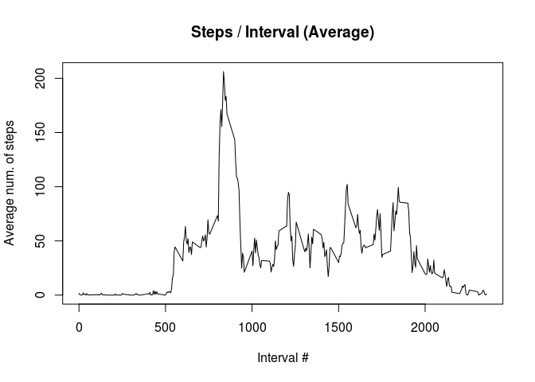
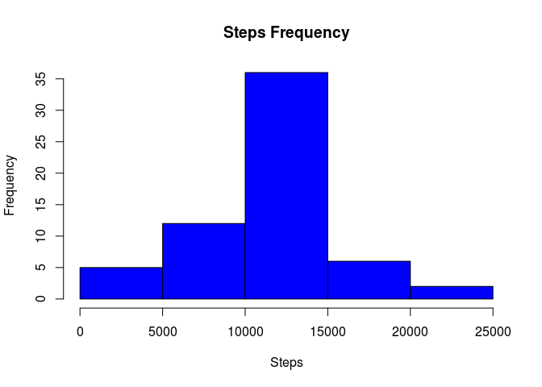
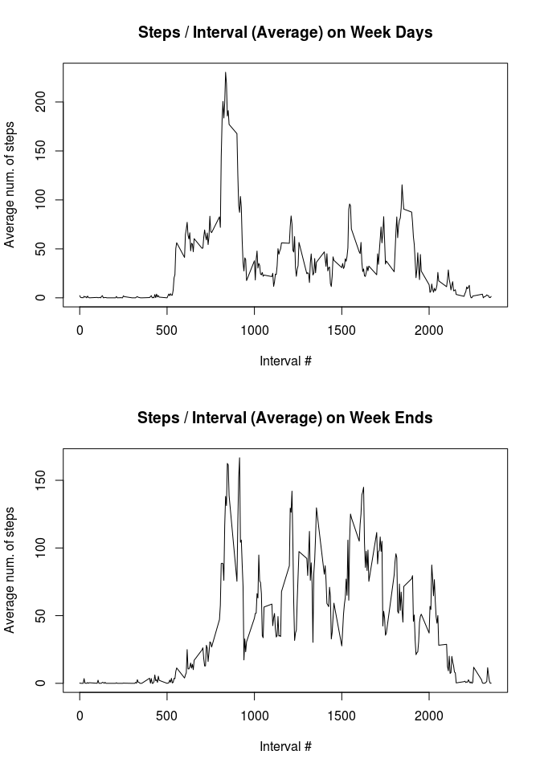

# Activity Monitoring Data
Arnaud Legoubin  
May 29, 2016  


```r
    ## US Locale for dates
    Sys.setlocale("LC_TIME", 'en_US.UTF-8')
```

```
## [1] "en_US.UTF-8"
```

## Loading and preprocessing the data

1. Load the source data set out of **activity.csv** source file:


```r
    ## Read source data
    sourceData <- read.csv(file = 'activity.csv', header = TRUE, sep = ",")
```

2. Convert fields to the right format


```r
    ## Convert fields into correct format
    sourceData$date <- as.Date(sourceData$date,format = "%Y-%m-%d")
    sourceData$steps <- as.numeric(sourceData$steps)
    sourceData$interval <- as.numeric(sourceData$interval)
```


## What is mean total number of steps taken per day?

1. Remove NA Data


```r
    noNAData <- na.omit(sourceData)
```

2. Aggregate steps by date


```r
    aggTotalnoNAData <-
        aggregate(noNAData$steps,by = list(date = noNAData$date), FUN = sum)
    colnames(aggTotalnoNAData) <- c("date","steps")
```

3. Print histogram that shows steps frequency


```r
    with(aggTotalnoNAData,hist(
        steps,col = "blue",xlab = "Steps",main = "Steps Frequency"
    ))
```

<!-- -->

4. Display the mean and median


```r
    mean(aggTotalnoNAData$steps,na.rm = TRUE)
```

```
## [1] 10766.19
```

```r
    median(aggTotalnoNAData$steps,na.rm = TRUE)
```

```
## [1] 10765
```
    
    
## What is the average daily activity pattern?

1. Remove NA and aggregate mean step value by interval


```r
    #remove na
    noNAData <- na.omit(sourceData)
    
    #compute mean by interval
    aggMeannoNAData <-
        aggregate(noNAData$steps,by = list(interval = noNAData$interval), FUN =
                      mean)
    colnames(aggMeannoNAData) <- c("interval","steps")
```

2. Build a line plot to show steps by interval


```r
    with(
        aggMeannoNAData,plot(
            x = interval,y = steps,type = "l",main = "Steps / Interval (Average)",xlab =
                "Interval #",ylab = "Average num. of steps"
        )
    )
```

<!-- -->

The peak value is obtained at interval **835** (using the which.max function): 
```
aggMeannoNAData[which.max(aggMeannoNAData$steps),1]
``` 


## Imputing missing values

1. Build a function to automatically replace NA values with the mean values for each interval. This function will be called whenever we need a fixed data set.


```r
getFixedNAData <- function(sourceData) {
    
    #compute mean by interval
    aggMeannoNAData <-
        aggregate(
            na.omit(sourceData)$steps,by = list(interval = na.omit(sourceData)$interval), FUN =
                mean
        )
    colnames(aggMeannoNAData) <- c("interval","steps")
    
    #use mean step by interval to fill in na values
    fixedNAData <-
        merge(x = sourceData[is.na(sourceData),]  , y = aggMeannoNAData, by = "interval")
    
    fixedNAData <- fixedNAData[,c("steps.y","date","interval")]
    colnames(fixedNAData) <- c("steps","date","interval")
    
    #put this back with the complete cases orignal data set
    fixedNAData <- rbind(na.omit(sourceData),fixedNAData)
    
    return(fixedNAData)
    
}
```

Here, we extract rows with NA value first, then get the mean step value for interval and update the mean results back in the original data set using the **merge** function. 

2. Get aggregate of total steps for each date based on the fixed data set.


```r
    fixedNAData <- getFixedNAData(sourceData)
    
    aggTotalData <-
        aggregate(fixedNAData$steps,by = list(date = fixedNAData$date), FUN = sum)
    colnames(aggTotalData) <- c("date","steps")
```

3. Display histogram that shows step distribution


```r
    with(aggTotalData,hist(
        steps,col = "blue",xlab = "Steps",main = "Steps Frequency"
    ))
```

<!-- -->

4. Show the mean and median from this data set


```r
    mean(aggTotalData$steps,na.rm = TRUE)
```

```
## [1] 10766.19
```

```r
    median(aggTotalData$steps,na.rm = TRUE)
```

```
## [1] 10766.19
```

The same analysis performed on both data sets (without NA values and with mean values) clearly shows similar results. The natural conclusion is that trying to fix the NA values did not change the distribution, mean and median of the variables.
 
We can also recheck the mean plot showing steps by interval to confirm this conclusion:
    

```r
    fixedNAData <- getFixedNAData(sourceData)
    
    #compute mean by interval
    aggMeanData <-
        aggregate(
            fixedNAData$steps,by = list(interval = fixedNAData$interval), FUN = mean
        )
    colnames(aggMeanData) <- c("interval","steps")
    
    #line plot to display average mean by interval
    with(
        aggMeanData,plot(
            x = interval,y = steps,type = "l",main = "Steps / Interval (Average)",xlab =
                "Interval #",ylab = "Average num. of steps"
        )
    )
```

<!-- -->

As expected, the results are identical as the highest value is also found on step 835:

```r
    aggMeanData[which.max(aggMeanData$steps),1]
```

```
## [1] 835
```
 
## Are there differences in activity patterns between weekdays and weekends?

1. First, let's reuse the fixed NA data set and add a new column in the data set using the transform function to check whether the date is week end or not.


```r
    fixedNAData <- getFixedNAData(sourceData)
    
    fixedNAData <-
        transform(fixedNAData,weekdayflag = ifelse(
            weekdays(date) %in% c("Saturday","Sunday"),"Week End","Week Day"
        ))
```
 
2. Compute mean step value by interval for both week days and week end days


```r
    fixedNADataMeanByIntervalWD <-
        aggregate(
        fixedNAData[fixedNAData$weekdayflag == "Week Day",]$steps,by = list(interval =    fixedNAData[fixedNAData$weekdayflag == "Week Day",]$interval), FUN =
        mean
        )
        fixedNADataMeanByIntervalWE <-
        aggregate(
        fixedNAData[fixedNAData$weekdayflag == "Week End",]$steps,by = list(interval = fixedNAData[fixedNAData$weekdayflag == "Week End",]$interval), FUN =
        mean
        )
        colnames(fixedNADataMeanByIntervalWD) <- c("interval","steps")
        colnames(fixedNADataMeanByIntervalWE) <- c("interval","steps")
```
 
 3. Build two line plots for each case


```r
     par(mfrow = c(2, 1))
    with(
        fixedNADataMeanByIntervalWD,plot(
            x = interval,y = steps,type = "l",main = "Steps / Interval (Average) on Week Days",xlab =
                "Interval #",ylab = "Average num. of steps"
        )
    )
    with(
        fixedNADataMeanByIntervalWE,plot(
            x = interval,y = steps,type = "l",main = "Steps / Interval (Average) on Week Ends",xlab =
                "Interval #",ylab = "Average num. of steps"
        )
    )
```

<!-- -->

The pattern of steps taken is different: whereas the mean of weekend steps are more equally distributed across all intervals, the weekdays have a realively early peak and then become lower for the rest of the day maybe due to work. 
